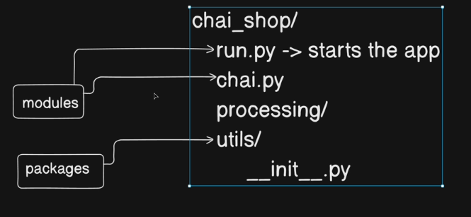

🐍 Virtual Environment (venv) – Short Notes
🔹 What is Virtual Environment?

A virtual environment is an isolated Python environment for a specific project.

✅ Purpose:

Install packages per project

Avoid version conflicts

Keep system Python clean

Professional project setup

🔹 Why Needed?

Example:

Project A → Django 3.2

Project B → Django 4.2

If installed globally:

pip install django

Both projects use same version ❌ → Conflict

👉 Virtual environment solves this by isolating dependencies.

🔹 Concept

Global Python = Entire system
Virtual Env = Separate mini Python inside project

Each project has:

Its own Python

Its own pip

Its own packages

🔹 How to Use
1️⃣ Create
python -m venv myenv
2️⃣ Activate (Windows)
myenv\Scripts\activate

You’ll see:

(myenv)
3️⃣ Install Packages
pip install django
4️⃣ Deactivate
deactivate
📦 requirements.txt – Short Notes
🔹 What is requirements.txt?

A file that stores project dependencies with exact versions.

Example:

Django==4.2.7
djangorestframework==3.14.0
requests==2.31.0
🔹 Why Important?

Ensures:

Same dependencies

Same versions

Same behavior across systems

Prevents deployment bugs.

🔹 Create requirements.txt
pip freeze > requirements.txt
🔹 Install from requirements.txt
pip install -r requirements.txt

Recreates exact project environment.

// Folder organization :
